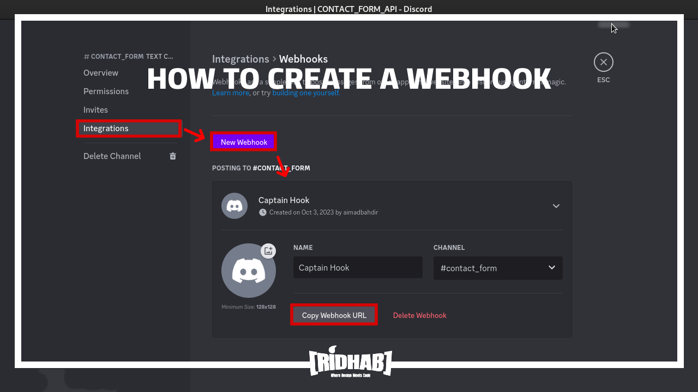
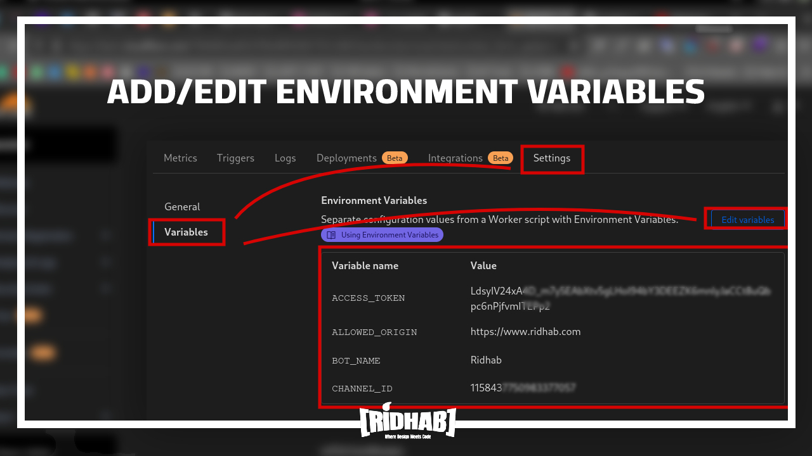
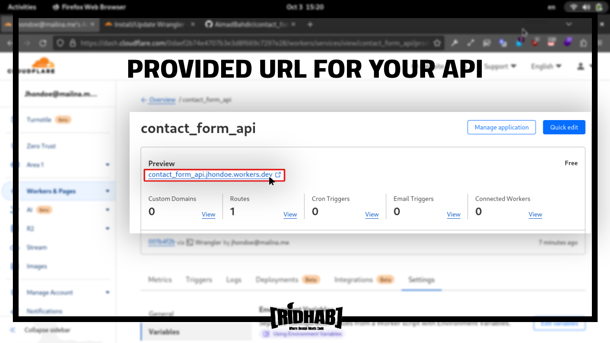
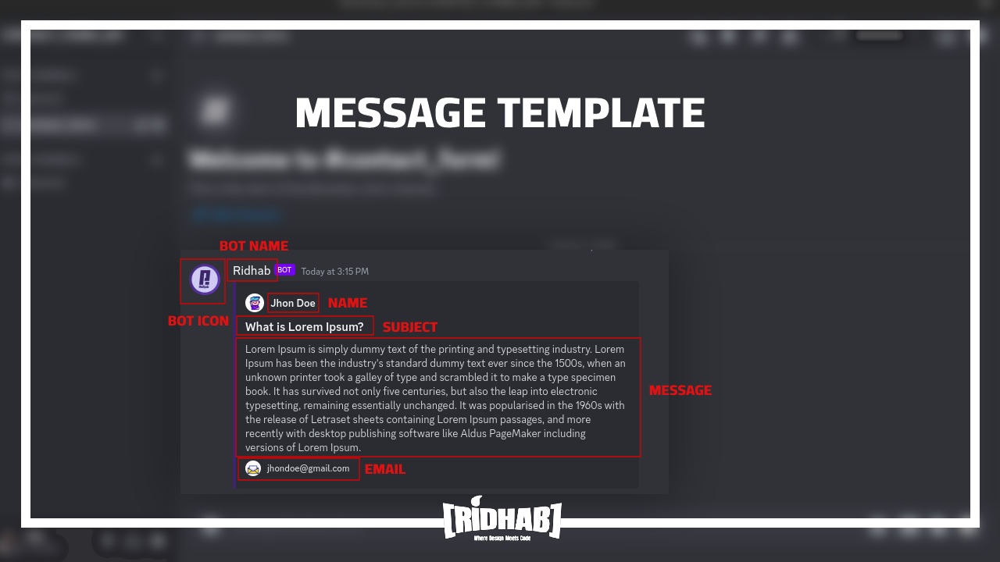

## <p align="center">Contact Form API with Discord Integration</p>

This project is a Cloudflare Workers project managed with the Wrangler package. Its primary goal is to provide an easy-to-integrate solution for creating a custom API for contact forms, allowing you to receive messages directly in your Discord server.

**Getting Started**

Follow these steps to set up the Contact Form API on your own Cloudflare account:

* Clone the Repository:

      git clone https://github.com/AimadBahdir/contact_form_api.git
* Install Wrangler:

      npm install wrangler --save-dev

* Create a Discord Account and Server:

    - Sign up for a Discord account if you haven't already.
    - Create a server to host your contact form messages.

* Create a Cloudflare Account:

    - Sign up for a Cloudflare account.

* Authenticate Wrangler with Cloudflare:
    - Log in to your Cloudflare account.
    - Run the following command and follow the prompts:

          wrangler login


* Get Discord Webhook URL:

    - Create a webhook in your Discord server to receive messages.
    - Go to Edit Channel (⚙️) -> Integrations -> Webhooks -> New Webhook.
    - Copy the webhook URL.


<p align="center"><a href="#"></a></p>

* Update Environment Variables:

    - After deploy the project add/update the environment variables from the Cloudflare dashboard.


<p align="center"><a href="#"></a></p>

**here is the list of environment variables :**
```
    WEBHOOK_URL: (required)
        Description: Your discord webhook URL.
        Example: WEBHOOK_URL="YOUR WEBHOOK URL"

    ALLOWED_ORIGIN: 
        Description: URL of the website that will use your API.
        Default Value: "*" (any website can use your API.)
        Example: ALLOWED_ORIGIN="YOUR WEBSITE URL"

    BOT_NAME:
        Description: Name of the bot that will send messages to your Discord server.
        Default Value: "Ridhab"
        Example: BOT_NAME="NAME YOUR BOT"

    BOT_ICON:
        Description: URL of the bot icon.
        Default Value: "URL to Ridhab's icon"
        Example: BOT_ICON="URL TO YOUR BOT ICON"

    EMBED_COLOR:
        Description: The right border color of the embed message.
        Default Value: 16777215 (white)
        Example: EMBED_COLOR=COLOR WITH DECIMAL FORMAT

    REDIRECTION:
        Description: Redirection URL if the API request method is different than POST.
        Default Value: "https://www.ridhab.com"
        Example: REDIRECTION="REDIRECTION URL FOR METHODS DIFFERENT THAN POST"
```

* Deploy the project with Wrangler:

      wrangler deploy

* Access Your API:

    - Cloudflare will provide a specific URL for your API. Copy it and use it in your applications by sending contact form data as a POST request.

<p align="center"><a href="#"></a></p>
    

Contact form data object :
```
   body: {
      "name": "Jhon Doe",
      "email": "jhondoe@gmail.com",
      "subject": "What is Lorem Ipsum?",
      "message": "Lorem Ipsum is simply dummy text of the printing and typesetting industry. Lorem Ipsum has been the industry's standard dummy text ever since the 1500s, when an unknown printer took a galley of type and scrambled it to make a type specimen book. It has survived not only five centuries, but also the leap into electronic typesetting, remaining essentially unchanged. It was popularised in the 1960s with the release of Letraset sheets containing Lorem Ipsum passages, and more recently with desktop publishing software like Aldus PageMaker including versions of Lorem Ipsum."
   }
```

<p align="center"><a href="#"></a></p>

<br/>

### **Contributing**

Pull requests are welcome. For major changes, please open an issue first to discuss what you would like to change.
<br/><br/>

### <p align="center">[](https://opensource.org/licenses/MIT)
</p><br/><br/>